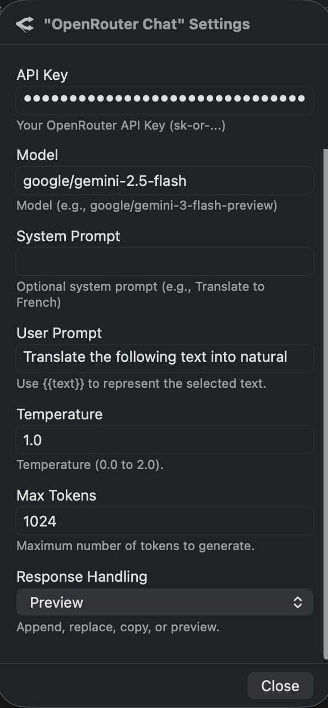

# OpenRouter Chat for PopClip

A PopClip extension that sends selected text to OpenRouter and returns the model output.

## Screenshot



## Features

- OpenRouter Chat Completions API integration
- Configurable model, system prompt, user prompt, temperature, and max tokens
- Multiple output modes:
  - append below selection
  - replace selection
  - copy to clipboard
  - PopClip preview

## Requirements

- macOS with [PopClip](https://www.popclip.app/)
- OpenRouter API key from [openrouter.ai/keys](https://openrouter.ai/keys)
- PopClip extension minimum version: `4225`

## Install

### Option 1: Install from source folder (development)

1. Ensure folder name is `OpenRouter.popclipext`.
2. Double-click the folder in Finder to install.

### Option 2: Build `.popclipextz` package (distribution)

```bash
npm run package
```

Output:

`builds/OpenRouter.popclipextz`

Then double-click the package to install.

> This extension is unsigned. PopClip may show a warning before installation.

## Configuration

All settings are configured in PopClip extension settings:

- `API Key` (`secret`): OpenRouter key, e.g. `sk-or-...`
- `Model`: e.g. `google/gemini-3-flash-preview`
- `System Prompt`: optional system instruction
- `User Prompt`: optional prompt template (`{{text}}` placeholder supported)
- `Temperature`: `0.0` to `2.0`
- `Max Tokens`: positive integer
- `Response Handling`:
  - `Append`
  - `Replace`
  - `Copy`
  - `Preview`

## Local Development

```bash
npm run typecheck
npm run release-check
```

`release-check` verifies:

- required files exist
- `Config.yaml` key fields are valid
- TypeScript check passes
- packaged `.popclipextz` contains required files

## Project Structure

- `Config.yaml`: PopClip extension config
- `action.ts`: main JS action logic
- `package.sh`: packaging script
- `scripts/release-check.sh`: pre-release validation

## Troubleshooting

- If PopClip shows a shaking `X`, check:
  - API key is set
  - model name is valid on OpenRouter
  - network access is available
  - timeout is sufficient for selected model

## License

MIT. See `LICENSE`.
